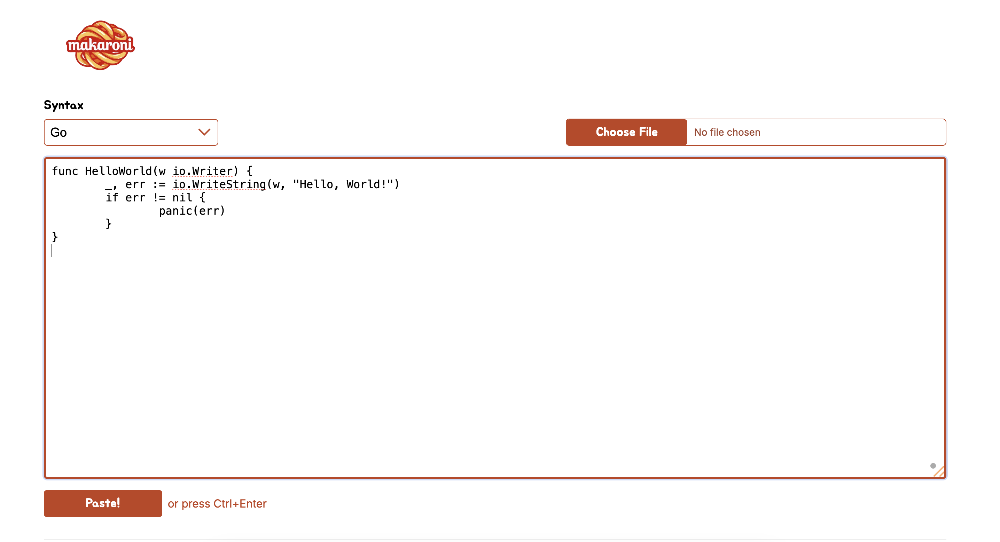
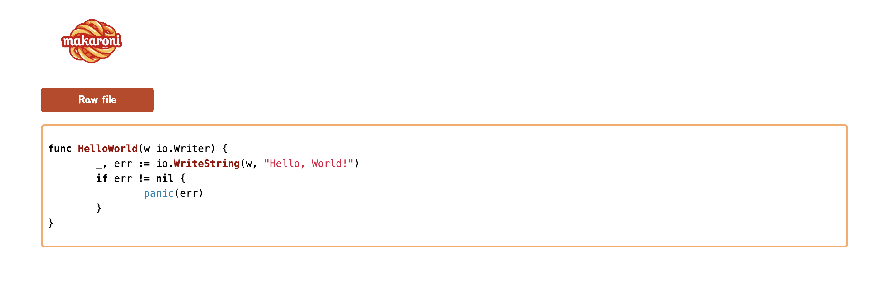

# Forked from https://github.com/kaero/makaroni

# Makaroni
Makaroni is a lightweight pastebin-like application that allows users to create and share text snippets and files.
Written in Go, uses S3 for file storage.



## Configuration


# How to run

## Docker Compose
### Prerequisites

- Go (recommended version 1.18+)
- Docker
- Docker compose (for local dev environment)

1. Just run `make dev`

## Kind
### Prerequisites

- Go (recommended version 1.18+)
- Kind (https://kind.sigs.k8s.io/)
- Kind cloud provider (https://kind.sigs.k8s.io/docs/user/loadbalancer/)
- Helm (for kind environment)

1. **Install kind**  
   ```
   brew install kind
   ```

2. **Install cloud-provider-kind**  
   ```
   go install sigs.k8s.io/cloud-provider-kind@latest
   ```

3. **Create the cluster configuration file**  
   Create a file, for example at `~/kind-cluster.yaml`, with the following content:

   ```
   kind: Cluster
   apiVersion: kind.x-k8s.io/v1alpha4
   nodes:
    - role: control-plane
      extraMounts:
        - containerPort: 80
          hostPort: 80
          protocol: TCP
        - containerPort: 443
          hostPort: 443
          protocol: TCP
   ```

4. **Create the kind cluster**  
   Run the following command (update the config path if necessary):

   ```
   kind create cluster --config /kind-cluster.yaml
   ```

5. **Run cloud-provider-kind**  
   To enable proper port mapping, execute:

   ```
   sudo ~/go/bin/cloud-provider-kind -enable-lb-port-mapping
   ```

6. **Configure Helm and Local Values**  
   In the Helm chart directory (for example, `helm/makaroni`), modify the `local-values.yaml` file. An example content:

   ```
   replicaCount: 1
   image:
   repository: "REPLACE_WITH_YOUR_REPO"   # Replace with your Docker repository
   tag: "latest"
   secret:
   name: "docker-secret"
   enabled: true
   dockerconfigjson: |
   {
     "auths": {
       "your-docker-registry.com": {
         "auth": "MY_DOCKER_SECRET"   # Replace MY_DOCKER_SECRET with your base64 encoded Docker secret
       }
     }
   }
   ```

7. **Deploy the Application with Helm**  
   Navigate to the Helm chart directory and execute:

   ```
   helm upgrade -i pasta . -f local-values.yaml
   ```

## Summary

After completing these steps, you will have a local dev environment up and running with kind.  
Remember to update all placeholders with your actual paths and secret values.
